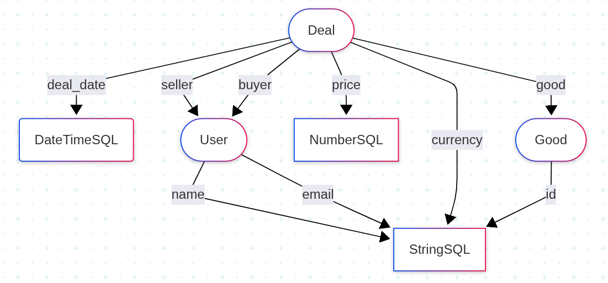
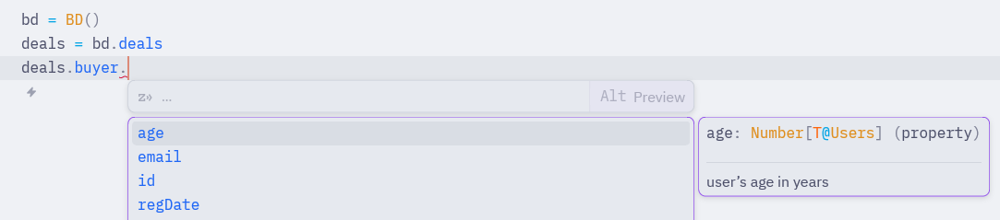

> This is an English translation of my article on [Habr](https://habr.com/ru/articles/973966)

# TypeQL: SQL for analysts that knows everything about your data

I've been using SQL for as long as it has been annoying me (the only thing that saves me is that now you can generate it with LLMs). Today I want to talk about my prototype of a language for writing large and complex analytical queries that compiles to SQL.

Before I start promoting my creation, I need to properly criticize SQL. So, what I don't like about it:

## SQL Problems

- **No functions and loops** (some databases implement them, but they're not in the standard). And this is clearly necessary if we want to write large queries and reuse code

- **Overcomplicated syntax** — WHERE, HAVING, QUALIFY all essentially perform the same filtering operation (this problem was solved by another interesting project [PRQL](https://prql-lang.org/))

- **I want a good LSP server**, so the language relies more on the database structure, knows what can be joined with what, what the relation types are (1:m, m:1), and doesn't let you add strings to numbers at the time of writing the code

I could criticize SQL for a long time in great detail, as any of us could, but it's time to move on.

## A New Approach

I want to propose a language that will be:

1. based on the data structure
2. metric-oriented

So what is a data structure? In the classical approach, it's a list of tables, each table has columns, and each column has a type and some constraints:

- **PRIMARY KEY** — a unique value, semantically the field by which you're supposed to find the right row in the table
- **FOREIGN KEY** — a reference to a column in another table (usually a primary key). A row in the dependent table must be uniquely determined
- **UNIQUE** — a unique value
- **NOT NULL** — it's not null anywhere
- **CHECK** — an arbitrary constraint, for example `status IN ('created', 'completed')` or `age > 0`

That's basically it. If SQL used this information about the database — it would already be great. But since we're creating a new language, we can describe the data structure in a new way too.

Let's abstract away from which physical tables our data is stored in, and think about it from the perspective of the real world.

In the real (object-oriented) world we have:

- **Types** (the structure of a table — what columns it has and what constraints they have)
- **Objects** (table rows) — they always have some type
- **Parameters** of objects (table columns)
- Other objects can also be parameters
- For each object, the values of its parameters are uniquely determined

For example, let's say I have an exchange described by 3 tables:

```sql
CREATE TABLE users (
  id INT PRIMARY KEY,
  name VARCHAR(100) NOT NULL,
  email VARCHAR(100),
  invited_by INT,

  FOREIGN KEY (invited_by) REFERENCES users(id)
);

-- goods of 2 types: either a pet or a machine
CREATE TABLE goods (
  id INT PRIMARY KEY,
  is_alive BOOLEAN NOT NULL,
  sex VARCHAR(100), -- pets have a sex
  brand VARCHAR(100) -- machines have a brand
);

CREATE TABLE deals (
  id INT PRIMARY KEY,
  seller INT NOT NULL,
  buyer INT NOT NULL,
  good_id INT NOT NULL,
  price DECIMAL(10,2) NOT NULL,
  currency VARCHAR(100) NOT NULL,
  deal_date DATETIME NOT NULL,

  FOREIGN KEY (seller) REFERENCES users(id),
  FOREIGN KEY (buyer) REFERENCES users(id),
  FOREIGN KEY (good_id) REFERENCES goods(id)
);
```

Let's convert this to an object-oriented representation, written in pseudo-Python:

```python
class User:
    def id() -> NumberSQL: ...
    def name() -> StringSQL: ...
    def email() -> StringSQL | Null: ...
    def invited_by() -> User | Null: ...

class Pet:
    def id() -> NumberSQL: ...
    def is_alive() -> BooleanSQL: ...
    def sex() -> StringSQL: ...

class Machine:
    def id() -> NumberSQL: ...
    def is_alive() -> BooleanSQL: ...
    def brand() -> StringSQL: ...

class Deal:
    def id() -> NumberSQL: ...
    def seller() -> User: ...
    def buyer() -> User: ...
    def good() -> Pet | Machine: ...
    def price() -> NumberSQL: ...
    def currency() -> StringSQL: ...
    def deal_date() -> DateTimeSQL: ...
```

Such a structure can be schematically represented as a directed graph (the schema is slightly simplified in the diagram)


This representation is very close to the 4th normal form, and even a bit broader — it allows you to describe a discriminated union like `def good() -> Pet | Machine: ...` You can't describe such a dependency neatly in a database.

But the main idea is that I now look at data as a structure of dependent objects. As an analyst, I take a deal, and I want to know what I can uniquely determine from that deal. And my representation answers exactly that question.

The idea is not new — a similar representation was described by David Spivak [for example here](https://categoricaldata.net/cql/Broad_SoftEng.pdf). And while preparing for this article, I came across a project that went even further, applying full type theory to describe the database structure: https://typedb.com (a project with a very similar idea and name 😄). How did I not find it earlier!

In general, the idea is that this schema doesn't need to be written by hand — it is automatically generated from the database. And some additional information that is not in the database structure can be passed through tags in column comments in the database. I'll write more about this at the end.

So, we already have a data structure — the IDE knows it and can give hints:



Already great! It even shows comments for each parameter!

## Metric-Oriented Approach

But it's time to move on to creating a full Query Language. Here we remember that we are making a metric-oriented language, so the result of any query is a metric (a pair of dimension → parameter), where dimension is one of our types (or a Cartesian product of several), and parameter — as before — is something that is uniquely determined by the dimension.

For example, for each deal we can calculate the price in dollars:

```python
d = BD().deals  # this is the dimension of our metric — an element of the Deals class
price_usd = caseSQL({
    d.currency == 'RUB': d.price * 0.0127,
    d.currency == 'EUR': d.price * 1.1,
    d.currency == 'USD': d.price,
})  # multiply by the right exchange rate depending on the currency

d.price_usd = price_usd  # now the IDE will suggest it
```

(I should note that this is the syntax I would like to see; in reality it couldn't be achieved — it had to be done in a messier way)

So the result of any query is a new parameter that naturally fits into the structure, and it can be reused in other queries! Moreover, we can use all the power of a normal programming language — functions and loops.

For example, we can define our metric as a function:

```python
def price_usd(rub_rate: float, eur_rate: float):
    return caseSQL({
        d.currency == 'RUB': d.price * rub_rate,
        d.currency == 'EUR': d.price * eur_rate,
        d.currency == 'USD': d.price,
    })

d.price_usd = price_usd  # so the IDE gives hints
```

By the way, the idea that a metric-oriented language for analytical queries is a good thing is also not new, described [for example here](https://docs.getdbt.com/docs/build/about-metricflow).

## Metric Formalism

Great, we've learned how to calculate simple metrics! In the Python implementation I defined a metric as a generic type: `result[source]`, where `result` is the parameter type and `source` is the type indicating the dimension. The metric from our example has type `NumberSQL[DealsSrc]`.

Let's describe what we can already do with metrics in the new formalism. We can apply any scalar function (allowed in SQL) if:

1. The arguments have the same source. The result will have the same source: `f(a[s], b[s], c[s]) -> metrica[s]`. But `f(a[s1], b[s2])` will give an error
2. Their types are allowed for the given function (`NumberSQL + NumberSQL` — allowed, `NumberSQL + StringSQL` — not allowed)

Great, we can calculate any scalar metrics! Now we need to deal with aggregation.

## Aggregation

This is simple. For aggregation I need:

1. An aggregation function (there are just 5: `aggSum`, `aggAvg`, `aggMin`, `aggMax`, `aggCount`, `aggUniq`)
2. A metric (which we will aggregate) `metrica[source]`
3. A path to a new dimension `newSource[source]` (which is also a metric). This can be a tuple of several paths `(newS1[source], newS2[source])`

The result is a metric with a new source (dimension) `metrica[newSource]`. Or, if there were several paths, the new source will be their Cartesian product `metrica[cartesian[newS1, newS2]]`.

In SQL this would look like:

```sql
SELECT
    path,
    SUM(metrica) -- or another aggregation function
FROM some_table
-- maybe some joins here
GROUP BY path
```

Example metric with explicit types for clarity (in reality everything is computed):

```python
result: NumberSQL[UserSrc] = aggSum(
    deals.price: NumberSQL[DealsSrc],
    deals.buyer: User[DealsSrc]
)
```

The only difference is that the result remains a metric and can be reused further.

## That's Basically It

By this point we've learned to do just 4 things:

**For parameters:**

1. Calculate scalar functions from parameters
2. Calculate aggregation functions

**For dimensions (sources):**

1. Create new dimensions via Cartesian product of existing ones
2. Create new dimensions via union of existing ones (what is denoted with `|` in Python, and in SQL this is `UNION ALL`)

Surprisingly, this is already enough to express any SELECT query (ORDER BY is missing, but that's a minor thing). Of course, window functions would be nice — even though they can be expressed through subqueries, it is very inconvenient. So I need to figure out how to add them to my syntax.

About filtering: you can currently filter rows via `caseSQL`, for example like this:

```python
success_deals = caseSQL({
    deals.status == "success": deals
}, default=Null)
```

But since it's a frequent operation, it probably makes sense to create a separate function for it.

That's basically the whole idea of my metric-oriented and well-typed language as a replacement for SQL. I'm curious what everyone thinks — write in the comments, I'll read everything.

Here https://github.com/korbash/typeql I implemented a prototype compiler to SQL. It can't actually compile yet and the data schema is hardcoded, but you can look at [query examples](https://github.com/korbash/typeql/tree/simple-struct/examples) and test how the IDE helps write a query: it knows what parameters each type has, won't let you add metrics with different sources, won't let you add a string and a number.

## Technical Challenges

I have to say, I ran into some difficulties here — I hit the limits of Python's type system, and I'm already forced to use various workarounds. I even found a [bug](https://github.com/microsoft/pyright/issues/11035#event-20309595358) in Pyright.

I spent a long time looking for a language that could handle my type-checking needs. One of the main requirements is that it must work well with sum types. If a user gets a metric with type `Pet | Machine`, the language must understand what parameters Pet has, what Machine has, and suggest all of them in autocomplete.

And this feature, surprisingly, is present in very few languages. Python and TypeScript have it, but languages known for strong type systems don't fit here: Lean, OCaml, Haskell — all miss the mark. Scala possibly, but I'm not sure.

TypeScript fits best, but it doesn't support operator overloading, which is a big downside in my case.

In general, the question of which language to use for writing such a library remains open. If anyone has ideas — I'd be happy to hear them.

## Generating Schema from a Database

The situation with generating schema from a database is not so bad. All databases support column comments, and through special tags like `@id`, `@ignore`, `@virt(currency.id)`, `@link(pets, machines)` in these comments you can pass additional schema information — things that couldn't be expressed the standard way through PRIMARY/FOREIGN KEY.

They are easy to parse, and besides them the comment can also contain regular human-readable text. The tags are compact — they don't get in the way of reading the comment.

## Use Cases

Actually, it all started because I was really frustrated that in BI systems it's hard to embed filters. You can't just write a query and have the filters automatically follow it — for each filter you need to specify what its allowed values are or what query to use to get them. This is about tools like Superset, Metabase. For DataLens, Tableau, there's a different problem — they effectively merge everything into one big table (via a view, but still) and then work with it. Here the problem is different — the data structure is lost.

My language, on the other hand, has one of its main advantages — it always knows the type of each metric. For example, if I want to add a filter on buyers. In the code it's enough to write something like:

```python
buyerFilter: User[DealsSrc] = filter(deals.buyer)
```

(The type is shown explicitly here for clarity)

In the dashboard nothing additional needs to be configured — it already knows everything. From the filter it knows what parameters the user has, and you can set up filtering on all of them right in the UI — by registration date, country, age, whatever. And default parameters can be passed directly in the query code.

That's why the language is primarily for embedding in BI and data exploration systems. In the future possibly in ELT pipelines like SQLMesh or dbt. For non-analytical queries my language will probably be useless.
